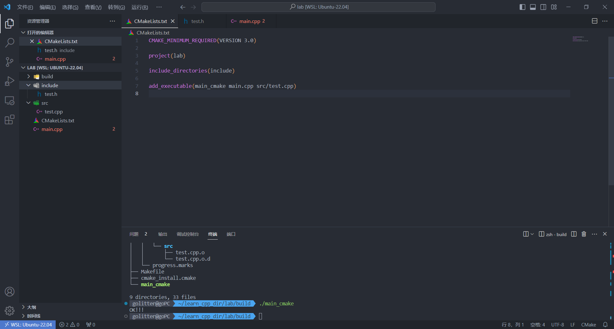

## 构建方式

有两种构建方式，分别为内部构建和外部构建。

- 内部构建 （不建议使用）

  内部构建会在	 同级目录下产生一大堆中间文件，这些中间文件并不是我们最终所需要的，和工程源文件放在一起会显得杂乱无章。

- 外部构建（推荐使用）

  将编译输出文件与源文件放到不同目录中

  ```shell
  .
  ├── build
  ├── CMakeLists.txt
  └── main.cpp
  ```


## 简单实操

源文件和头文件分别在不同的目录下进行实操。

创建目录

```shell
 mkdir include src build
```

分别在头文件和源文件内写入内容。

```shell
.
├── CMakeLists.txt
├── build
├── include
│   └── test.h
├── main.cpp
└── src
    └── test.cpp

3 directories, 4 files
```

`CMakeLists.txt`内内容：

```cmake
CMAKE_MINIMUM_REQUIRED(VERSION 3.0)

project(lab)

include_directories(include)

add_executable(main_cmake main.cpp src/test.cpp)

```

进入到`build`目录下：

```shell
cd build
```

生成MakeFile文件：

```shell
cmake ..
```

构建可执行文件：

```shell
make -j8
```

`build`目录下内容：

```shell
.
├── CMakeCache.txt
├── CMakeFiles
│   ├── 3.22.1
│   │   ├── CMakeCCompiler.cmake
│   │   ├── CMakeCXXCompiler.cmake
│   │   ├── CMakeDetermineCompilerABI_C.bin
│   │   ├── CMakeDetermineCompilerABI_CXX.bin
│   │   ├── CMakeSystem.cmake
│   │   ├── CompilerIdC
│   │   │   ├── CMakeCCompilerId.c
│   │   │   ├── a.out
│   │   │   └── tmp
│   │   └── CompilerIdCXX
│   │       ├── CMakeCXXCompilerId.cpp
│   │       ├── a.out
│   │       └── tmp
│   ├── CMakeDirectoryInformation.cmake
│   ├── CMakeOutput.log
│   ├── CMakeTmp
│   ├── Makefile.cmake
│   ├── Makefile2
│   ├── TargetDirectories.txt
│   ├── cmake.check_cache
│   ├── main_cmake.dir
│   │   ├── DependInfo.cmake
│   │   ├── build.make
│   │   ├── cmake_clean.cmake
│   │   ├── compiler_depend.make
│   │   ├── compiler_depend.ts
│   │   ├── depend.make
│   │   ├── flags.make
│   │   ├── link.txt
│   │   ├── main.cpp.o
│   │   ├── main.cpp.o.d
│   │   ├── progress.make
│   │   └── src
│   │       ├── test.cpp.o
│   │       └── test.cpp.o.d
│   └── progress.marks
├── Makefile
├── cmake_install.cmake
└── main_cmake

9 directories, 33 files
```

运行可执行文件：

```
./main_cmake 
```

