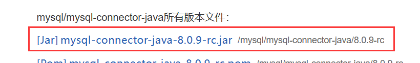
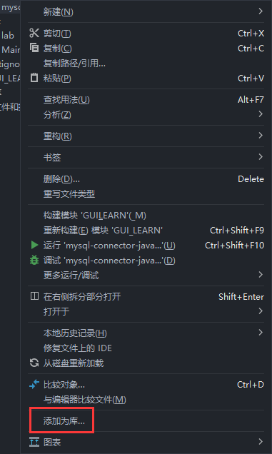
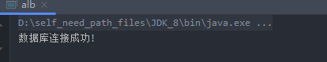

## `JDBC`介绍

`JDBC(Java Database Connectivity)`是一个独立于特定数据库管理系统、通用的`SQL`数据库存取和操作的公共接口（一组API），定义了用来访问数据库的标准的Java类库，使用这个类库可以以一种标准的方法、方便地访问数据库资源
`JDBC`为访问不同的数据库提供了一种统一的途径，为开发者屏蔽了一些细节问题。
`JDBC`的目标是使Java程序员使用`JDBC`可以连接任何提供了`JDBC`驱动程序的数据库系统，这样就使得程序员无需对特定的数据库系统的特点有过多的了解，从而大大简化和加快了开发过程。

执行流程：

- 连接数据源，如：数据库。
- 为数据库传递查询和更新指令。
- 处理数据库响应并返回的结果。


## 下载及入库

`JDBC`下载网址：[mysql/mysql-connector-java所有版本Jar文件及下载 -时代Java (nowjava.com)](https://nowjava.com/jar/version/mysql/mysql-connector-java.html)



下载完成后，将其`.jar`文件放到项目的一个目录中。


之后，点击这个文件，选择`添加到库中`。



此时，将`JDBC`添加到库中了。


## `JDBC`结构

- `DriverManager`类：依据数据库的不同，管理`JDBC`驱动。
- `Connection`接口：负责连接数据库并担任传送数据的任务。
- `Statement`接口：由`Connection`产生，负责执行`SQL`语句。


### 驱动管家：`DriverManager`类

用于加载驱动类：

5点多的版本是：

```java
Class.forName("com.mysql.jdbc.Driver");
```

最新版本（8.0以上）的是：

```java
Class.forName("com.mysql.cj.jdbc.Driver");
```


### 获取数据库连接对象

```java
connection = DriverManager.getConnection(jdbcUrl, username, password);
```

5点多的版本是：

```java
String url = "jdbc:mysql://IP地址:端口号/数据库名字";
```

最新版本（8.0以上）的是：

```java
String url = "jdbc:mysql://IP地址:端口号/数据库名字?useSSL=false";
```

> MySQL 8.0 以上版本不需要建立 SSL 连接的，需要显示关闭。


连接数据库：

```java
    public static void databaseDeal() {
        try {
            Class.forName("com.mysql.cj.jdbc.Driver");
            String user = "root"; // 超级管理员用户,拥有对于所有数据对象的所有操作权限
            String password="sa123";
            String passwd = "mysql";
            String url = "jdbc:mysql://82.157.19.240:3306/airport_db?useSSL=false";
            // 用驱动管理类的方法来创建数据库连接对象
            Connection connection = DriverManager.getConnection(url, user, passwd);
            System.out.println("数据库连接成功!");
        } catch (ClassNotFoundException ex) {
            // 捕捉并处理类未找到异常
            System.out.println("数据库连接失败！");

        } catch (SQLException ex) {
            // 捕捉并处理SQL异常(创建数据库连接对象的时候或者执行SQL语句的时候)
            System.out.println(ex.toString());
            System.out.println("数据库连接失败！");

        }
    }
```




[Java MySQL 连接 | 菜鸟教程 (runoob.com)](https://www.runoob.com/java/java-mysql-connect.html)